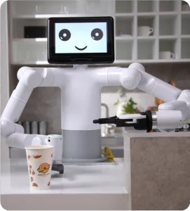

# 1.1 Design Concept

The Mercury B1 dual-arm humanoid robot has a total of 17 degrees of freedom. It is equipped with two A1 seven-axis robotic arms, capable of independent single-arm operation and coordinated dual-arm operation. The head is equipped with a 9-inch high-definition LCD touch screen, supporting multi-point control and user-customizable facial expressions. It also features the NVIDIA Jetson Xavier edge computing core as the main control module. With AI performance up to 21 TOPS combined with an integrated 3D camera, it can perform 2D/3D machine vision guidance, grasping, and VR remote operation.

| Feature | Description |
| --- | --- |
| Name | Mercury B1 |
| Type | Dual-arm humanoid robot |
| Degrees of Freedom | 17 degrees of freedom |
| Applications | Research, education, service, entertainment, remote operation |

 
Mercury B1 Humanoid Robot

## Design Concept

The design concept of the Mercury B1 humanoid robot stems from a deep understanding of the needs in the current technology education and research fields. The rapid development of high-tech fields such as machine learning and artificial intelligence requires experimental equipment to have not only general functionality but also flexibility and precision. The design aims to meet these complex needs, providing a solution that is both flexible and precise and can adapt to various application scenarios.

| Component | Function |
| --- | --- |
| Harmonic Module | Provides high precision, high inertia, low weight |
| Hollow Wiring | Facilitates maintenance and upgrades |
| NVIDIA Jetson Xavier | Main control collaborates with secondary control |
| 2D Vision | Enhances perception capabilities |

## Design Goals

| Design Goal | Description | Application Scenarios and Features |
| --- | --- | --- |
| **General Multi-functional Platform** | The Mercury B1 humanoid robot is suitable for various application scenarios such as education, research, and commercial demonstrations. | Its multi-degree-of-freedom arms support complex motion control in various work environments. |
| **Support for Research and Education** | The Mercury B1 humanoid robot is particularly suitable for machine learning and artificial intelligence research, capable of performing high-precision experiments and technical demonstrations. | Supports end-to-end data training and reproduction, as well as basic visual tasks, making it an ideal device in laboratories. |
| **Programmability and Expandability** | The high programmability of the Mercury B1 humanoid robot allows users to customize and program according to emerging technologies to meet future technological needs. | Through user-customized programming, the device can achieve optimized operations and experimental results, meeting the ever-changing needs of research and development. |
| **Technological Innovation and Knowledge Dissemination** | The Mercury B1 humanoid robot can serve as a platform for showcasing the latest technological achievements in commercial demonstrations, aiming to enhance public understanding and interest in technology and promote the commercialization of technological innovations. | By showcasing and demonstrating the latest technological achievements, it increases public engagement, promotes the dissemination of technological knowledge, and enhances market acceptance of technological products. |

## Product Features

| Feature | Advantage |
| --- | --- |
| Long Battery Life | Meets long working hours requirements |
| Multi-sensing Capabilities | Strong environmental adaptability |
| Modular Design | Easy maintenance and upgrades |

## Product Value

| Value | Impact |
| --- | --- |
| Education and Research | Promotes education and research in the field of intelligent robotics |
| Commercial Services | Enhances interactivity and efficiency in commercial activities |
| Personal Entertainment | Enriches personal entertainment experiences and stimulates creativity |

## Industry Contribution

| Contribution | Description |
| --- | --- |
| Research Tool | Provides an experimental platform for humanoid robot research |
| Educational Resource | Serves as a teaching tool to cultivate robotics technology talents |
| Service Innovation | Promotes the intelligent transformation of the service industry |

## Product Applications

| Application Scenario | Function |
| --- | --- |
| Research | Dual-arm coordinated control |
| Education | Image recognition, robot control teaching |
| Service | Exhibition services, company demonstrations |
| Entertainment | Humanoid motion simulation |
| Remote Operation | VR/Aloha remote control |

## 3. Supported Extension Development

The Mercury B1 humanoid robot is highly valuable in the fields of education and research, especially in the widely used development environments of Python and ROS (Robot Operating System). These environments provide strong support, enabling the Mercury series products to be widely used in machine learning, artificial intelligence research, complex motion control, and visual processing tasks.

| | |
| --- | --- |
| **Python** | - Provides standardized robot driver libraries, available for download and installation via PyPI - Supports querying joint angle data, Cartesian coordinate data, etc. - These features make Mercury suitable for basic education and research scenarios, especially in data collection and preliminary robot control |
| **ROS** | - Supports both ROS1 and ROS2 versions, providing RVIZ simulation environment support. - Allows users to display the robotic arm and collect the status information of the robotic arm in real-time, making Mercury suitable for ROS beginners and educational purposes. |
| **Hardware Interfaces** | - Includes IO, USB, etc., facilitating the connection of various sensors and actuators. |
| **Software Libraries** | - Provides a rich set of open-source libraries and APIs to simplify the development process. |

---

[Next Chapter →](../2-ProductFeature/README.md)