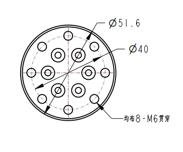
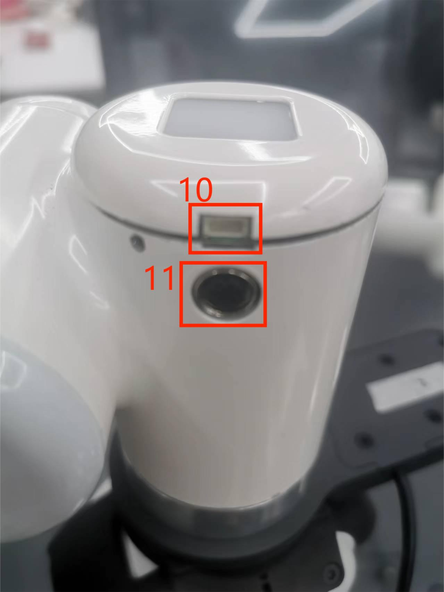

# 机器人参数说明

> 第一章中，我们探讨了产品的卖点及其设计理念，为您提供了对产品高层次理解的全景视角。现在，让我们进入第二章——机器人参数说明。这一章节将是您理解产品技术细节的关键。详细了解这些技术参数，不仅可以帮助您充分认识到我们产品的先进性和实用性，而且还能够确保您能够更有效地利用这些技术来满足您的具体需求。

## 1 机器参数

|指标|参数|
|:------------: |:----------------------------: |
|中文名称|水星B1双臂机器人|
|型号|水星B1|
|产品尺寸|200\*192.5*537mm|
|自由度 |17 |
|最大工作半径|8小时|
|最大负载|1KG|
|机械臂重复精度|±0.05 mm|
|净重|8KG|
|工作电压|24V|
|重复精度|+-0.05mm|
|减速机构|谐波减速机|
|关节制动式|电磁摩擦片式|
|CPU |6核Arm v8.2 64位CPU |
|GPU|384 核 Volta™ GPU |
|算力 |21 TOPS|
|材质|碳纤维、铝合金、工程塑料|
|3D相机|Obi Nakakotsu Deeyea|
|麦克风阵列| 线性4麦克风，5米180°拾音|
|IO |24V 6 输入，6 输出 |
|屏幕|9寸触摸屏
|通讯方式|CAN总线/WIFI/网口/蓝牙/USB/串口|

## 2 软件基本功能支持

| 功能/开发环境| 用途 |
| :------------: | :--------: |
| 自由行动| 支持|
| 关节运动| 支持|
| 笛卡尔运动| 支持|
| 轨迹记录| 支持|
| 无线控制| 支持|
| 紧急停止| 支持|
| Windows | 支持|
| Linux | 支持|
| MAC| 支持|
| ROS 1 | 支持|
| Python | 支持|
| C++ | 支持|
| C# | 支持|
| JavaScript | 支持|
| myblockly | 支持|
| Arduino | 支持|
| mystudio | 支持|
| 串口控制协议| 支持|
| TCP/IP | 支持|
| MODBUS | 支持|

  ---

# 3 控制核心参数

### 主控制器规格表

| 指标| 参数|
| :--------------:| :----------------: |
| 主控| Jetson Xavier |
| 主模型| Jetson Xavier NX |
| 中央处理器 | 6 核 NVIDIA Carmel ARM®v8.2 64 位 CPU   6MB L2 + 4MB L3 |
| 图形处理器 | 具有 48 个 Tensor 核心的 384 核 NVIDIA Volta™ GPU|
| 算力 | 21 TOPS |
| 存储| 16 GB eMMC 5.1 |
| CSI 摄像机 | 2 个 CSI 摄像机 |
| 网络| 10/100/1000 BASE-T 以太网|
| USB端口| 1 个 USB 3.2 2.0 (10 Gbps)   2 个 USB 2.0 端口|
| 其他输入/输出 | 2个UART串口|

### 左右臂副控制器规格表

| 指标            | 参数         |
| :---------------: | :----------------: |
| 副控     | 左右臂副控      | 
| 副控型号 | ESP32           |
| 核心参数 | 240MHz dual core.   600 DMIPS, 520KB SRAM.   Wi-Fi, dual mode Bluetooth |
| 辅控Flash | 4MB                |
| LED显示 | 5X5 RGB |

---

# 4 结构尺寸参数

> 本章的距离和角度单位为毫米。

## 产品尺寸和工作空间
   选择机器人安装位置时，重要的是要考虑机器人正上方和正下方的圆柱空间，并尽可能避免将工具移向圆柱空间。 因为这会导致工具运动缓慢时关节旋转过快，导致机器人效率低下且风险评估困难。
            
<!-- ## 2 底座安装尺寸 -->

## 双臂端法兰尺寸

 

端部尺寸图

## 产品尺寸

 
产品尺寸图

## 工作空间

 
工作空间

---

# 电气特性参数

##  底座接口概述

 
图1 基础接口图

##  底座接口说明

| 编号 | 接口 | 定义 | 特点 | 注意 |
|:----:|:--------------:|:---------:|:-----------------:|:----------------:|
|1  | 急停接口 | 停止      | 急停回路接口 |             | 
| 2   | DC/IO接口 | 24V       | 直流24V             |   DC24V输出 |
|      |                | OUT1      | 数字输出信号1~6 | 仅在 PNP 模式下输出 |
|      |                | OUT2      |                   |                  |
|      |                | OUT3      |                   |                  |
|      |                | OUT4      |                   |                  |
|      |                | OUT5      |                   |                  |
|      |                | OUT6      |                   |                  |
|      |                | GND       | GND               |                  |
| 3    | DC/IO接口 | GND       | GND               |                  |
|      |                | IN6       | 数字输入信号1~6 | 仅进入NPN模式 |
|      |                | IN5       |                   |                  |
|      |                | IN4       |                   |                  |
|      |                | IN3       |                   |                  |
|      |                | IN2       |                   |                  |
|      |                | IN1       |                   |                  |
|      |                | 24V       | 直流24V             |    DC24V输入 |
|4  | 以太网端口 |    以太网 | 以太网通讯接口 |             | 
| 5 | 电源输入接口 | DC24V输入 | DC24V输入 |                  |
|4 | 以太网端口 | 以太网 | 以太网通讯接口| |
| 5 | 电源输入接口| DC24V输入| DC24V输入| |
| 6 | 开关| 电源开关| 控制输入电源的通断| 带灯（灯亮）|
| 7 |R-USB | 右臂 USB | 用USB连接外置摄像头 | |
| 8 | L-USB | 左臂 USB | 用USB连接外置摄像头 | |
| 9 | USB3.0 | USB3.0*2 | 可连接外部设备或U盘|

---

## 末端接口总览

 
Figure 5 左臂末端图
 

 
Figure 6 右臂末端图
 

## 末端接口说明
| 编号 | 接口    | 定义 | 功能         | 备注         |
|:------:|:----------------:|:-----------:|:-------------------:|:------------------:|
| 6  |   4pinUSB端子   | 对外接口 | 连接摄像头 |  |
| 7   | M8航空插座 | 末端工具IO接口 |  与外部设备交互 |                  |

#### 如图所示是M8航空插座I/O图，Mercury B1机器人提供了一路输入和两路输出。

 
各个工具I/O端口的定义如下表所示，注意的是，工具I/O无论是输入还是输出都是PNP类型，接线方式同底部输出接口一致。

| 编号 | 信号 | 解释             | 配套M8线颜色 |
| :------: | :------: | :-----------------------: | :--------------------------: |
| 1      | GND    | DC24V 负极      | 白                      |
| 2      | OUT1   | 工具输出接口1 | 褐                      |
| 3      | OUT2   | 工具输出接口2 | 绿                      |
| 4      | 485A   | 预留, 未开发   | 黄                     |
| 5      | 24V    | DC24V 正极         | 灰                        |
| 6      | IN1    | 工具输入接口1  | 粉                       |
| 7      | IN2    | 具输入接口2             | 蓝                      |
| 8      | 485B   | 预留, 未开发   | 紫                    |

#### USB端子：用于连接摄像头

如果您已经阅读了本章的所有内容，可以继续阅读下一章。

[← 上一章](../1-ProductIntroduction/README.md) | [下一章 →](../3-UserNotes/README.md)
