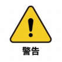

# User Notes

 <br>

> This chapter is an important part that every user of this product must read carefully. It covers key information about product usage, transportation, storage, and maintenance, aiming to ensure user safety and efficiency when operating the product. Additionally, this chapter details the responsibilities for product failures or damages caused by not following these guidelines.

## 1 Safety Instructions

### Overview

This chapter provides general safety information for personnel involved in the installation, maintenance, and repair of the Elephant Robot. Please read and understand the contents and precautions of this chapter before handling, installing, or using the product.

### Hazard Identification

The safety of collaborative robots is based on the correct configuration and use of the robot. Additionally, even if all safety instructions are followed, operators may still cause injury or damage. Therefore, it is very important to understand the safety risks of using the robot to prevent them.

Tables 1-1 to 1-3 list common safety risks that may occur during the use of the robot:

<center>Table 1-1 Risk Level Safety Risks</center>

|        |
| ---------------------------------------------------------------------- |
| 1 Personal injury or robot damage caused by improper robot operation. |
| 2 If the robot is not fixed as required, such as missing screws or loose screws, or the base's locking ability is insufficient to support the robot's high-speed movement, the robot will tip over, causing personal injury or robot damage. |
| 3 The robot's safety functions fail to work due to incorrect safety function configuration or lack of safety protection tools. |

<center>Table 1-2 Safety Risk Tips</center>

|                |
| ------------------------------------------------------------------------------- |
| 1 Do not stay within the robot's movement range when debugging programs. Improper safety configuration may not avoid collisions, causing personal injury. |
| 2 The connection between the robot and other equipment may bring new dangers, requiring a comprehensive risk assessment. |
| 3 Be careful of scratches and punctures caused by sharp surfaces such as other equipment or the robot's end effector in the working environment. |
| 4 The robot is a precision machine; stepping on it may cause damage. Improper placement during transportation may cause vibration, affecting internal parts and causing damage. Therefore, ensure stability and mechanical structure integrity in all cases. |
| 5 If the clamped object is not removed before the robot is powered off (when the clamping is not secure), it may cause damage to the end effector or injury due to the object falling off when powered off. |
| 6 There is a risk of accidental robot movement. Do not stand under any axis of the robot under any circumstances! |
| 7 Compared to ordinary mechanical equipment, robots have more degrees of freedom and a larger range of motion. Failure to stay within the range of motion may cause accidental collisions. |

<center>Table 1-3 Potential Electrical Shock Hazards</center>

|  |
| ----------------------------------------------------------------- |
| 1 Using non-original cables may pose unknown dangers. |
| 2 Electrical equipment coming into contact with liquids may cause leakage hazards. |
| 3 Incorrect electrical connections may cause electric shock. |
| 4 Be sure to turn off the power of the controller and related equipment and unplug the power plug before replacement. Operating with power on may cause electric shock or malfunction. |

### Safety Precautions

**Follow these safety rules when using the robotic arm:**

- The robotic arm is an electrical device. Non-professionals should not change the circuit at will, otherwise, it may cause damage to the equipment or the human body.
- When operating the robotic arm, follow local laws and regulations. The safety precautions and dangers, warnings, and cautions described in this manual are only supplements to local safety regulations.
- Use the robotic arm in the specified environment. Exceeding the specifications and load conditions of the robotic arm will shorten the product's lifespan and even damage the equipment.
- Personnel installing, operating, and maintaining the Mercury arm must receive strict training on safety precautions and the correct methods of operating and maintaining the robot.
- Do not use this product in a humid environment for a long time. This product is a precision electronic component, and long-term exposure to a humid environment will damage the equipment.
- Do not use this product in a humid environment for a long time. This product is a precision electronic component, and long-term exposure to a humid environment will damage the equipment.
- High-corrosion cleaning is not suitable for cleaning the robotic arm, and anodized parts are not suitable for soaking cleaning.
- Do not use the equipment without installing the base to avoid damage or accidents. Use the equipment in a fixed environment without obstacles.
- Do not use other power adapters for power supply. If the equipment is damaged due to the use of non-standard adapters, it is not covered by after-sales service.
- Do not disassemble, dismantle, or unscrew the screws or casing of the robotic arm. If disassembled by yourself, warranty service is not provided.
- Untrained personnel should not repair faulty products or disassemble the robotic arm without authorization. If the product fails, contact Mercury technical support engineers in time.
- If the product is discarded, comply with relevant laws and properly dispose of industrial waste to protect the environment.
- Children should use the equipment under supervision and turn it off after use.
- Do not reach into the movement range of the robot arm when the robot is moving to avoid collisions.
- It is strictly forbidden to change, remove, or modify the nameplate, instructions, icons, and signs of the robotic arm and related equipment.
- Handle and install carefully. Place the robot gently according to the instructions on the packaging box and place it correctly according to the arrow direction. Otherwise, the machine may be damaged.

- **Do not burn other product drivers from the Atom terminal or use non-officially recommended firmware. If the equipment is damaged due to the user burning other firmware, it is not covered by after-sales service.**
- Power specifications: **Use official power supply**
- USB Type-C usage specifications: **Do not connect to the power board**

**If you have any questions or suggestions about the content of this manual, please log in to the Elephant Robotics official website and submit relevant information:**

https://www.elephantrobotics.com

**Do not use the robotic arm for the following purposes:**

- Medical care costs in life-critical applications.
- Buying a bus may cause an environmental explosion.
- Direct use without risk assessment.
- Costs of using low-level safety functions.
- Lo-fi does not meet the performance parameters of robot use.

### Disclaimer

Please read and understand the following disclaimer before using the product:

- **Safe Use:** This product is designed for specific application scenarios. Ensure that all safety guidelines and operating manuals are followed during use. Users should receive appropriate training on product use and understand and comply with all relevant safety regulations.

- **Limitation of Liability:** The manufacturer is not responsible for any direct, indirect, incidental, special, or consequential damages resulting from the use or misuse of the product or any matters related to the product. This disclaimer does not cover or exclude liabilities that cannot be excluded by law.

- **Technical Support:** Please read the product documentation carefully during installation and use, and seek technical support from the manufacturer if necessary. For technical support issues, refer to the official documentation provided by the manufacturer or contact the relevant support channels.

- **Software Updates:** The manufacturer may provide updates for the product firmware or software. Users should regularly check and apply these updates to ensure product performance and safety.

- **Regular Maintenance:** Users should inspect and maintain the product according to the regular maintenance guidelines provided by the manufacturer. Regular maintenance and inspection help ensure the long-term performance of the product.

- **Customization and Modification:** Do not customize, modify, or change the product without explicit permission from the manufacturer. Any unauthorized modifications may void the product warranty and may have unpredictable impacts on safety and performance.

- **Legal Compliance:** Users should ensure that their use complies with all applicable laws and regulations. In some regions, the use of the product may be subject to specific regulations.

By using the Mercury B1 dual-arm humanoid robot, you agree to and accept these disclaimers. The manufacturer reserves the right to change product specifications, functions, and disclaimers without prior notice.

## 2 Transportation and Storage

### Logistics Transportation Requirements

|      |    |
|  ----  | ----  |
| Temperature  | 0°C~50°C |
| Relative Humidity  | 20%~70% |
| Direction during Transportation | Robot head up, arms down |
| External Conditions during Transportation  | Fixed with wooden frame to prevent squeezing |

### 2 Equipment Storage
|      |    |
|  ----  | :----  |
| Temperature  | 0°C~50°C |
| Relative Humidity  | 20%~70% |
| Direction during Transportation | Robot head up, arms down |
| Stacking Requirements  | Not stackable |
| Storage Environment | Indoor |
| Other Environmental Requirements | - Keep away from dust, oil smoke, salt, iron filings, etc. <br>- Keep away from flammable, corrosive liquids and gases. <br>- Do not come into contact with water. <br>- Do not transmit shocks and vibrations, etc. <br>- Keep away from strong electromagnetic interference sources. |

## 3 Maintenance and Care
As a robot manufacturer, we value ensuring that customers can properly and safely maintain and upgrade their robot equipment. To this end, we provide the following detailed maintenance and care guidelines, including common maintenance items and parts for repair or upgrade. Please read carefully.

### Common Maintenance Items and Recommended Intervals
| Maintenance Item | Description | Recommended Interval |
| :----- | :----- | :----- |
| Visual Inspection | Check for any visible damage, foreign object accumulation, or wear on the robot | Daily |
| Structural Cleaning | Clean the robot's structural components with a clean, dry cloth, avoiding moisture and corrosive cleaners | Daily |
| Fastener Check | Check and tighten all bolts and connectors | Daily |
| Lubrication | Lubricate joints and moving parts using manufacturer-recommended lubricants | Every 3 months |
| Cable and Wiring Check | Inspect cables and wiring for damage or wear | Monthly |
| Electrical Connection Check | Ensure all electrical connections are secure, free of corrosion or damage | Monthly |
| Software Updates | Check and update control software and applications | Whenever updates are available |
| Software Data Backup | Regularly back up critical software configurations and data | Quarterly |
| Firmware Updates | Regularly check and update firmware to obtain the latest features and security patches | Whenever updates are available |
| Sensor and Device Check | Inspect sensors and other critical devices to ensure proper operation | Monthly |
| Emergency Stop Function Test | Regularly test the emergency stop function to ensure reliability | Monthly |
| Environmental Condition Monitoring | Monitor the working environment's temperature, humidity, dust, etc., to ensure compliance with the robot's operating specifications | Continuous monitoring |
| Safety Configuration Review | Regularly check and confirm the robot's safety configurations, such as speed limits and working range settings | Monthly |
| Preventive Maintenance Plan Execution | Perform regular inspections and maintenance according to the manufacturer's maintenance plan | As per manufacturer's guidelines |

### Guidelines for Independently Changing Robot Hardware
We understand that customers may have the need to upgrade or repair robot hardware independently. Before performing any upgrade operations, please read the relevant product parameters in detail and confirm with our official personnel whether such operations are allowed. Unauthorized operations may lead to product failure and are not covered under warranty.

#### Material Requirements
Officially manufactured or recommended materials: All parts and components required for repairs and upgrades must be officially manufactured or explicitly recommended by us. This includes but is not limited to electronic components, sensors, motors, connectors, and any other replaceable parts.
Material acquisition: Customers can purchase the required repair and upgrade materials through our official channels. This ensures the quality and compatibility of the parts.

### Repair or Upgrade Process
Customer self-repair: Customers are responsible for completing the repair work. We will provide detailed repair guidance and manuals to guide customers through the repair steps.
Follow official guidance: Repair operations should strictly follow the official guidance provided by us. Any deviation from the official guidance may result in equipment damage.

#### Responsibility and Warranty Policy
##### Responsibility Division:
Manufacturer: Provide official guidance for repairs and upgrades, officially manufactured or recommended materials, and handle issues caused by manufacturing defects.
Customer: Responsible for completing repairs according to official guidance and using official parts.

##### Warranty Policy:
Warranty valid: The warranty is valid only if the repair operations fully comply with our guidance and use official parts.
Warranty invalid: If the customer does not follow the official guidance or uses non-official parts for repairs or upgrades, any resulting damage will not be covered under warranty.

#### Precautions
Safety first: Before performing any repair or upgrade operations, ensure that all safety guidelines are followed, including power-off and using appropriate protective equipment.
Technical support: If you encounter problems during the repair process, it is recommended to stop the operation and contact our technical support team for assistance.
We strongly recommend that customers strictly follow these guidelines to ensure the safe and effective operation of the robot equipment. Improper repair operations may result in equipment damage and affect the warranty status. If you need further guidance or support, please contact our professional technical team in time.

## 4 Frequently Asked Questions

### How to Ask Questions Gracefully

#### 1 When asking questions in various places, you may encounter the following phenomena:

- No response after asking a question.
- The question is answered after a long time.
- The other party always complains that you are too inexperienced.

#### 2 Before asking a question, make sure you have studied this manual.

Many questions will be resolved in this process. Avoid asking questions in QQ groups, forums, issues, or emails right from the start. Many questions explained in the documentation may not receive timely responses from the community. To save everyone's time and create a better community environment, please understand each other and grow together.

#### 3 When asking questions, try to do the following, which will greatly increase the chances of quickly resolving the issue:

##### Clarify what happened and what you did, including:

- What effect or function do I want to achieve?
- How did I do it to achieve this effect, and what was the specific process?
- What errors occurred during the implementation, and what were the phenomena (e.g., what was the reported error, and what was the **complete** error content)?
- Did I carefully read the error message, and did the error message suggest the cause and solution?
- Based on these error messages, can I solve the problem myself?
- Can I find a solution to the problem by searching the documentation, issues, and search engines?

#### 4 If you really cannot solve the problem yourself and need help, consider:

- Whom to ask, where to ask, who is more likely to answer my question, and what is the real-time nature?
- What data and phenomena should I provide to make the person willing to quickly help me solve the problem?
  - Provide my purpose (to let the responder know what you are doing)
  - Provide the complete implementation process and the phenomena that occurred during the process (to allow the responder to follow your process and reproduce the problem)
  - Point out the error and indicate where the phenomenon or result differs from my expectations (to let the responder know where it did not meet expectations)
  - Provide the error message, which needs to be complete, with as many screenshots and logs as possible. Do not be stingy with a small screenshot or only provide part of the log (because the responder may not have done this for a long time and may have forgotten some details, they need to quickly recall through screenshots and complete logs; and detailed logs can quickly locate the problem)

- How to ask questions in a way that appears sincere, so that even if I am inexperienced, everyone is willing to answer

#### 5 Question Template

Try to ask questions gracefully, without adding unnecessary tone words or complaints. Carefully consider each word and punctuation mark, and think from the responder's perspective about how to quickly help solve the problem. Too few words may not describe the problem clearly, while too many words may make people lose patience.

#### 6 Title

Whether asking questions in QQ groups or elsewhere, give your question a title of about 30 words that clarifies the central idea of the problem, including:

- The type of question, whether it is a question, a bug report, or an experience sharing, etc. This allows people to immediately understand what you want to do in a screen full of text.
- A sentence that clarifies the central idea of the problem, such as "Running the camera example program, error reset fail, could it be a hardware issue?"

So, a comprehensive title could be:

- "【mercury question】 Running the camera example program, error reset fail, could it be a hardware issue?"

Avoid titles like:

- "Ahhh, why is my board not working again"
- "Why can't my code run"
- "Why is my screen black"
- "【mercury question】 Received the development board, the screen is red with a line of small text, why?"
- "I ran the xxx program, and there was a problem"

You can ask like this:

- "【mercury question】 My board cannot start after I connected the power supply incorrectly. How can I determine where the board is damaged, and if possible, how can I fix it?"

#### 7 Content

First, from the responder's perspective, if asked a question:

- First, know what the other party wants to do and what their goal is.
- What steps did they follow to achieve this goal?
- What specific steps did they take, and at what step did the problem occur, so I can try to reproduce the phenomenon by following their steps? If the problem seems difficult to solve and there are no reproduction steps, it may take a lot of time to reproduce, so I will solve other problems first.
- What is the specific problem? If they only say there is a problem, how do I know what the problem is? Maybe they are feeling unwell? So, it is very important to explain the phenomenon when the problem occurs and point out where it differs from expectations. Otherwise, I have to guess and compare with expectations, which increases the time to solve the problem.
- When a problem occurs, I may need their log files to analyze the source code, etc. Otherwise, it may be difficult to solve the problem, so I will put this problem aside for now.

In summary, you can ask questions like this:

- Clearly state your goal, what you want to achieve, and what the phenomenon should be.
- Did I refer to any documentation, code, or tutorials?
- How to reproduce the error: specifically, what steps were taken, write each step in detail until the problem occurs.
- Clearly describe the phenomenon when the error occurs and where it differs from expectations, proving that the problem indeed occurred.
- Attach log files, screenshots, and even videos. Logs and screenshots must be complete, not just a small part. The responder may find some issues you did not notice from your complete logs and screenshots, which is very important.
- Additionally, paste the code with proper formatting to ensure it is readable and can be run directly.
- Finally, express gratitude to the community members who help answer your questions.

### Driver Related

#### 1 About Python

**Q: What do the parameters in the API send_base_coords([x, y, z, rx, ry, rz], speed) mean? What do rx, ry, and rz correspond to in Euler angles? What is the rotation order of Euler angles? What is the range of each parameter?**

- A: The parameters in the array are the coordinates of the Mercury B1 end, and speed is the velocity. rx, ry, and rz correspond to RPY, which are roll, pitch, and yaw, respectively. The order of Euler angles is zyx, and zyx is its own coordinate. The range of x, y, z is -350~350, -350~350, -41~523.9 (undefined range, if exceeded, inverse kinematics will return no solution). The range of rx, ry, rz is -180~180.

**Q: Are the Python APIs the same for different versions of the robotic arm?**

- A: The APIs are the same.

#### 2 About ROS
**Q: Can you provide the rviz model files and programming examples?**

- A: They can be found on our GitHub.
“https://github.com/elephantrobotics/mercury_ros”

**Q: Why do I get a permission error “/dev/ttyUSB0” when starting the rviz model file using ROS?**

- A: This is because the serial port permission is not granted. You should type sudo chmod 777 port name in the terminal.
  For example:
  ```
  sudo chmod 777 /dev/ttyUSB0
  ```

**Q: Why do I get the error \_init_() takes exactly 2 arguments (3 given) when running the ROS slider control and the model follows the command?**

- A: The pymercury library is not installed and started.

**Q: Why does the mercury_B1 angle not match the model angle after opening the rviz model when using ROS?**

- A: It is likely that the zero position of mercury_B1 is not calibrated, and the zero position of mercury_B1 needs to be calibrated.

### Software Issues

#### About ROS1

**Q: When switching to ~/catkin_ws/src in the terminal and using git to install or update mercury_ros, the target path “mercury_ros” already exists. What is the reason?**

- A: This means that there is already a “mercury_ros” package in ~/catkin_ws/src. You need to delete it in advance and then re-execute the git operation.

**Q: When running rosrun, the terminal error prompts “could not open port /dev/ttyUSB0: Permission: '/dev/ttyUSB0'”. Why?**

- A: Insufficient serial port permissions. Enter “sudo chmod 777 /dev/ttyUSB0” in the terminal to grant permissions.

**Q: Why can't ROS programs run in VSCode?**

- A: Because the VSCode terminal cannot load into the ROS environment, you need to run it in the system terminal.

**Q: When running rosrun, the terminal prompts “Unable to register with master node [http://localhost:11311]: master may not be running yet. Will keep trying.” What is the reason?**

- A: Before running the ROS program, you need to open the ROS node by entering “roscore” in the terminal.

**Q: When running rosrun, the terminal error prompts “could not open port /dev/ttyUSB0: No such file or directory: '/dev/ttyUSB1'”. Why?**

- A: Serial port error. You need to confirm the actual serial port of the current robotic arm. You can check it by `ls /dev/tty*`.

**Q: In Ubuntu 18.04, 'catkin_make' fails to build the code, and the terminal prompts 'Project 'cv_bridge' specifies '/usr/include/opencv' as an include directory, which is not found. And other error messages.**

- A: The OpenCV path in the configuration file does not match the actual system path. You need to use the sudo command to modify the configuration file (path is “/opt/ros/melodic/share/cv_bridge/cmake/cv_bridgeConfig.cmake”). The actual OpenCV path of the system is under the “/usr/include/” path.

**Q: Simply cloning the mercury_ros package and then directly running the rosrun program results in errors such as “package 'mercury_ros' not found” or errors like files not found?**

- A: The newly cloned mercury_ros needs to build the ROS environment compiled code. Enter in the terminal:

```
bash
cd ~/catkin_ws/
catkin_make
source devel/setup.bash
```

#### About Robotic Arm Control

**Q: The robotic arm does not move when sending angles or coordinates to it.**

- A: Use `get_angles()` to read the angles of the robotic arm. If the angles return empty, check if the robotic arm is powered on, and use `power_on()` to enable the robotic arm; check if the port number is used correctly.
If there are angles, check if the angles exceed the movement range as shown in Table 1. If they exceed the range, use `release_all_servos()` to relax all joints (note that the joints will fall after relaxation, so catch them), align the zero scale lines of joints 1~5, 7, and make joint 6 perpendicular to the zero scale line by 90 degrees. Then use `focus_all_servos()` to lock the joints, and use `set_servo_calibration(1)~set_servo_calibration(7)` to calibrate the zero points of each joint in sequence. Then use `get_angles()` to read the current joint angles. If the returned data is [0, 0, 0, 0, 0, 90, 0], the calibration is successful. Otherwise, repeat the previous calibration steps.

<center> Table 1-1 Joint Angle Movement Range</center>

|   Joint   | Range   |
|  :----:  | :----:  |
| J1  | -175 ~ +175 |
| J2  | -65 ~ +115 |
| J3| -175 ~ +175 |
| J4  | -180 ~ +10 |
| J5| -175 ~ +175 |
| J6| -20 ~ + 173 |
| J7| -180 ~ +180 |

**Q: The camera cannot be opened.**

- A: Open the local camera to see if it can switch to the left and right arm cameras. If a certain camera cannot be viewed, re-plug the USB port or change the USB port.
If it can switch to the left and right cameras, check if the camera port has changed (the port may change after restarting).

**Q: The adaptive gripper cannot be controlled.**

- A: Check the power indicator of the adaptive gripper. The indicator should be steady on when normal. If the indicator flashes, re-plug the connection cable between the gripper and the robotic arm. If the indicator returns to steady on, it is normal.
If the indicator is steady on but still cannot be controlled, use `set_gripper_mode(0)` to change the gripper usage mode.

### Hardware Issues

#### 1 About Structure

**Q: What is the role of Atom in the robotic arm?**

- A: Atom mainly controls the kinematic algorithms of the robotic arm, including forward and inverse kinematics, solution selection, acceleration and deceleration, speed synchronization, multi-power interpolation, coordinate transformation, etc. Programs related to Atom are not yet open source.

**Q: The motor automatically cuts off power during use. Why?**

- A: The motor has overheat protection for long-term use. This phenomenon is normal and can be used again after a few minutes.

#### 2 About Parameters

**Q: What is the speed unit of the robotic arm?**

- A: The running speed is 180 degrees/second.

**Q: Can the adaptive gripper not be fully closed?**

- A: There will be a certain gap between the jaws, and they are not fully closed. You can adjust it by increasing the thickness of the gap between them.

**Q: How to fix the USB camera at the end of the robotic arm?**

- A: It needs to be fixed with a flange, which can be purchased separately.

If you have purchase intentions or any parameter questions, please send an email to this address.
[Email](sales@elephantrobotics.com) : "sales@elephantrobotics.com"

If the listed questions cannot help you solve the problem, and you have more after-sales questions, please send an email to this address.
[Email](support@elephantrobotics.com) : "support@elephantrobotics.com"

----
[← Previous Chapter](/2-ProductFeature/README.md#) | [Next Chapter →](/4-FirstInstallAndUse/README.md)