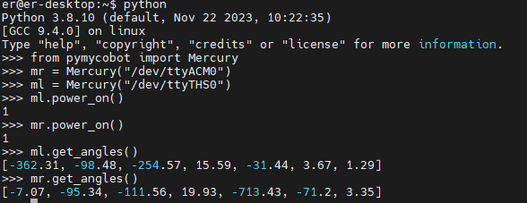

# Product Standards List

## Product Standards Comparison Table

| Serial Number | Product |
| -------------- | ----------------------------- |
| 1 | Mercury_B1 Robot |
| 2 | Product Manual |
| 3 | Certificate of Conformity |
| 4 | User Instructions |
| 5 | Shipping List |
| 6 | Power Supply (24V) |

**Note:** After the packaging box is in place, please confirm that the robot packaging is intact. If there is any damage, please contact the logistics company and the supplier in your area in time. After unpacking, please check the actual contents in the box against the item list.

---

# Product Unboxing Guide

## 1 Product Unboxing Graphic Guide

**Why You Need to Follow the Steps Below to Remove the Product**

In this section, we strongly recommend following the specified steps to remove the product. This not only helps ensure that the product is not damaged during transportation but also minimizes the risk of accidental failures. Please carefully read the following graphic guide to ensure that your product is safe during the unboxing process.

- **1** Check if the box is damaged. If there is any damage, please contact the logistics company and the supplier in your area in time.
- **2** Open the packaging box and take out the user instructions, sponge packaging cover, Mercury_B1 robot, matching power supply, and shipping list.
- **3** Before proceeding to the next step, please ensure that each step has been completed to prevent unnecessary damage or omissions.

**Note:** After removing the product, please carefully check the appearance of each item. Please check the actual items in the box against the item list.

---

# 3 Power-On Detection Guide

## External Cable Connection

Please carefully read the **Chapter Safety Instructions** before operation to ensure safe operation. At the same time, connect the power adapter to the base.

Connect the power adapter to the robotic arm and move the robot to an open area to prevent collisions.

After pressing the emergency stop switch, the robot will stop moving immediately. To reset, turn the emergency stop switch clockwise, and the emergency stop switch will automatically pop up. After that, you can power on and resume control.

Click the power switch and ensure that the emergency stop is in the reset state to start using the robotic arm.

## Enter the Power-On Interface

 Screen Lights Up

Enter the login interface and input the power-on password **Elephant**.

## Basic Function Detection

### Check if the Dual Arms Can Move Normally: 
1. Open the terminal and enter the Python environment. 
2. Import the pymycobot package, initialize the left and right arms, and power on. 
3. Use get_angle() to get the joint angles. If the angles can be obtained, the power-on is successful. 
4. Calibrate the zero point, and use get_angle() again to get the joint angles. When the return is [0.0, 0.0, 0.0, 0.0, 0.0, 90.0, 0.0], the zero point calibration is successful. 
5. Control the left and right arms to see if they can move. If they move successfully, the robotic arm is normal.

 Get Joint Angles After Power-On

----

[← Previous Chapter](../3-UserNotes/README.md) | [Next Chapter →](/6-SDKDevelopment/README.md)