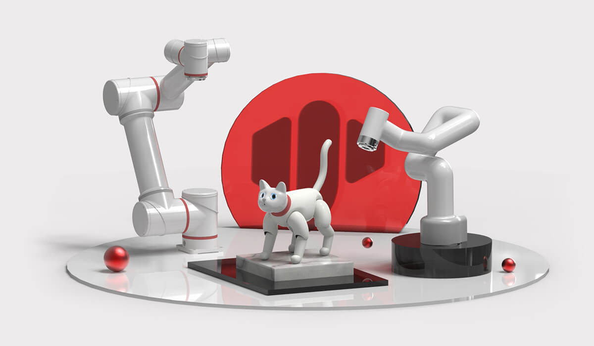

# Elephant Robotics

 

### 1. Company Introduction

Elephant Robotics, based in Shenzhen, China, is a high-tech enterprise focused on the research, design, and development of robots and automation solutions.

We are dedicated to providing highly flexible collaborative robots, easy-to-learn operating systems, and intelligent automation solutions for robot education and research institutions, commercial scenarios, and industrial production. Our product quality and intelligent solutions have been highly recognized and praised by several world-renowned companies from South Korea, Japan, the United States, Germany, Italy, Greece, and other countries.

Elephant Robotics adheres to the vision of "Enjoy Robots World," advocating for the collaborative work between humans and robots. We aim to make robots good helpers in human work and life, helping people to be liberated from simple, repetitive, and tedious tasks, fully leveraging the advantages of human-robot collaboration to improve work efficiency and create a better new life for humanity.

In the future, Elephant Robotics hopes to promote the development of the robotics industry through new-generation cutting-edge technology and work together with customers and partners to usher in a new era of automation and intelligence.

---

 

### 2. Development History

  - 2016.08 ----- Elephant Robotics Co., Ltd. was officially established
  - 2016.08 ----- Entered HAX incubator and received seed round investment from SOSV
  - 2016.08 ----- Started developing Elephant S industrial collaborative robot
  - 2017.01 ----- Rated as "Top 10 Most Innovative Companies in China" at CES
  - 2017.04 ----- Attended Hannover Messe and Korea Automation Show
  - 2017.07 ----- Two founders selected as "30 Under 30 Business Elites" by Forbes Asia
  - 2017.10 ----- Fifth generation single-arm industrial collaborative robot Elephant S launched
  - 2018.04 ----- Received angel round investment from "Cloud Angel Fund"
  - 2018.06 ----- Made first public appearance at Hannover Messe 2018
  - 2018.06 ----- Won "Intelligent Manufacturing Entrepreneurship MBA Award" from Cheung Kong Graduate School of Business
  - 2018.06 ----- Won "X-elerator Award" from Tsinghua University School of Economics and Management
  - 2018.11 ----- Won second place in the Shenzhen division of the Asia Smart Hardware Competition
  - 2018.11 ----- Won "Most Investable Company Award" at the GG Gold Ball Awards
  - 2019.03 ----- Won "Leader Award" at the GG Gold Ball Awards
  - 2019.04 ----- Catbot won "Industrial Robot Innovation Award" in March 2019
  - 2019.09 ----- Attended Huawei European Ecosystem Conference (HCE) and officially became a Huawei ecosystem partner
  - 2019.11 ----- Attended IROS International Conference on Intelligent Robots and Systems with Harbin Institute of Technology
  - 2019.12 ----- "Intelligent Robot Joint Development Laboratory" with South China University of Technology officially unveiled
  - 2019.12 ----- Won "Innovation Technology Award" at the GG 2019 Annual Awards
  - 2019.12 ----- Won "Top 10 Fast-Growing Companies" at the GG 2019 Annual Awards
  - 2019.12 ----- Won "New Enterprise Award" in the industrial robot segment of the Shenzhen Equipment Industry Awards
  - 2019.12 ----- World's first bionic robot cat MarsCat launched
  - 2020.05 ----- Founder won "2019 Shenzhen Robotics New Talent Award"
  - 2020.10 ----- World's lightest and smallest six-axis collaborative robot myCobot launched
  - 2021.03 ----- Smallest collaborative robot for research myCobotPro 320 launched
  - 2021.05 ----- MarsCat received extensive media coverage from Xinhua Finance, China Daily, Nanjing Daily, Harbin Daily, and others
  - 2021.07 ----- Launched the smallest composite robot chassis - myAGV
  - 2021.09 ----- World's first fully enclosed four-axis robotic arm myPalletizer launched
  - 2022.01 ----- Featured in a series of reports on lightweight consumer-grade robots by 36Kr and GeekPark
  - 2022.02 ----- MarsCat and myCobot appeared on the Spring Festival Gala live broadcast on CCTV and participated in a special program on Shenzhen Satellite TV
  - 2022.05 ----- Launched the most compact small six-axis robotic arm mechArm, focusing on AI robot education
  - 2022.06 ----- Collaborated with Unity engine to launch an introductory book on AI robot practice (international course) based on myCobot robot
  - 2022.07 ----- Launched the simulation companion robot cat metaCat in the AI era
  - 2022.07 ----- Launched the smallest dual-arm collaborative robot mybuddy
  - 2022.08 ----- Won "Top 10 Non-Industrial Technology Innovation Award"
  - 2022.08 ----- Founder won "2022 Shenzhen Robotics New Talent Award"
  - 2022.11 ----- Runner-up in the real-time engagement track of the iFLYTEK AI Developer Competition
  - 2022.12 ----- Won "Best Robot Award" at the 2022 World Voice Expo 1024 Science and Technology Expo
  - 2023    ----- Donated to Shanghai Putuo District Zhanyi Children's Intelligence Service Center, Shenzhen Futian District Tongban Shiguang Special Children's Rehabilitation Center, and Ren Da Elderly Industry Group
  - 2023.01 ----- Featured in a CCTV News interview with Huaqiangbei entrepreneurs "Towards Spring | Late Night Huaqiangbei"
  - 2023.01 ----- Launched desktop high-precision robotic arm ultraArm
  - 2023.02 ----- Microsoft successfully conducted ChatGPT for Robotics experiments using Elephant myCobot 280 robotic arm
  - 2023.03 ----- Certified as a specialized and new enterprise in Shenzhen
  - 2023.06 ----- Selected as one of the first "Intelligent Robot Application Demonstration Cases" in Shenzhen
  - 2023.07 ----- Featured in a special report by Shenzhen Business Daily "Collaborative Robots, Born for Companionship | A 'Big Elephant' Emerges from Huaqiangbei"
  - 2023.07 ----- Fourth place in the South China division of the 15th China Shenzhen Innovation and Entrepreneurship Competition and the 9th China Hardware Innovation Maker Competition
  - 2023.08 ----- Launched the world's smallest seven-degree-of-freedom collaborative robotic arm myArm
  - 2023.09 ----- Selected for the "2023 NVIDIA Inception Showcase"
  - 2023.09 ----- Received a thank-you letter from the Shenzhen Municipal Organization Department
  - 2023.10 ----- Second prize in the finals of the 5th China Chip Competition
  - 2023.10 ----- Awarded as an excellent enterprise in high-end manufacturing in the finals of the 12th China Innovation and Entrepreneurship Competition
  - 2023.11 ----- Received "Export Commodity Brand Certificate" from the China Council for the Promotion of International Trade
  - 2023.11 ----- Top three in the national finals of the 9th China Hard Innovation Competition
  - 2023.11 ----- Hosted the Elephant Robotics & OpenCV AI Robot Practical Training Camp
  - 2023.12 ----- Featured in the 137th issue of the official Raspberry Pi magazine MagPi with a review article on the Elephant Robotics myCobot 280 desktop six-axis collaborative robotic arm
  - 2023.12 ----- Won the "2023 Robot Industry Research Contribution Award" & "Top 50 Most Investable Companies" from leaderobot
  - 2023.12 ----- Second prize in the finals of the first National Advanced Computing Technology Innovation Competition
  - 2023.12 ----- Launched the Mercury series of humanoid robots priced at ten thousand yuan

### 3. Related Links  
##### Purchase Links
  - Taobao: https://shop504055678.taobao.com
  - Shopify: https://shop.elephantrobotics.com/
  - AliExpress: https://elephantrobotics.aliexpress.com/store/1101941423
##### Other Information
- Official Website: https://www.elephantrobotics.com
- Videos
  - Bilibili: https://space.bilibili.com/2126215657
  - YouTube: https://www.youtube.com/c/Elephantrobotics
- Facebook: https://www.facebook.com/mycobotcreator/
- LinkedIn: https://www.linkedin.com/company/18319865
- X (Twitter): https://twitter.com/CobotMy
- Discord: https://discord.gg/2MAherp7nt
- Hackster: https://www.hackster.io/elephant-robotics

### 4. Contact Us
---

> Our working hours are on Chinese working days, from 10 AM to 6 PM Beijing time.

  - If you have any other questions, please contact us through the following email.  
[E-mail](support@elephantrobotics.com) :

<pre>
<code class="copyable">
support@elephantrobotics.com
</code>
</pre>

We will respond within 1-2 working days.

**WeChat**:  
We provide one-on-one service only for users who purchase myArm M&C series products through WeChat.

 

---

[← Previous Chapter](../7-ExamplesRobotsUsing/README.md) | [Next Chapter →](../9-Acknowledgments/README.md)