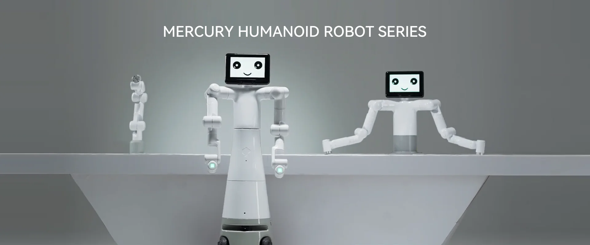
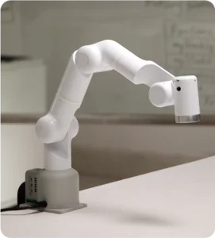

# Mercury_B1_Gitbook

Welcome to the world of Elephant Robotics' Mercury series, where innovation meets practicality, offering an unprecedented universal hardware platform for embodied intelligence and humanoid robot research. We proudly present three unique product models, each with its exceptional features to meet your diverse needs in robotics research and education.

**Mercury X1 Wheeled Humanoid Robot**: With 19 degrees of freedom, it combines a high-performance mobile base with advanced dual-arm coordination and perception capabilities, powered by the NVIDIA Jetson edge computing core and 3D machine vision, providing robust computing power and hardware foundation for robotics and embodied intelligence research and development.

 
Mercury X1 Wheeled Humanoid Robot

**Mercury B1 Semi-Humanoid Robot**: Featuring 17 degrees of freedom and dual seven-axis robotic arms, equipped with the NVIDIA Jetson edge computing core, 3D machine vision, and voice interaction capabilities, it is the first choice for human-robot interaction research and dual-arm coordination control research.

 
Mercury B1 Semi-Humanoid Robot

**Mercury A1 Seven-Axis Robotic Arm**: Ideal for educators, this 7-degree-of-freedom lightweight harmonic joint robotic arm has a payload of 1kg. Its touchable quick control interface and application software greatly simplify application deployment without complex programming.

 
Mercury A1 Seven-Axis Robotic Arm

The Mercury series is not only a culmination of robotic technology but also a partner in promoting scientific exploration and educational innovation.