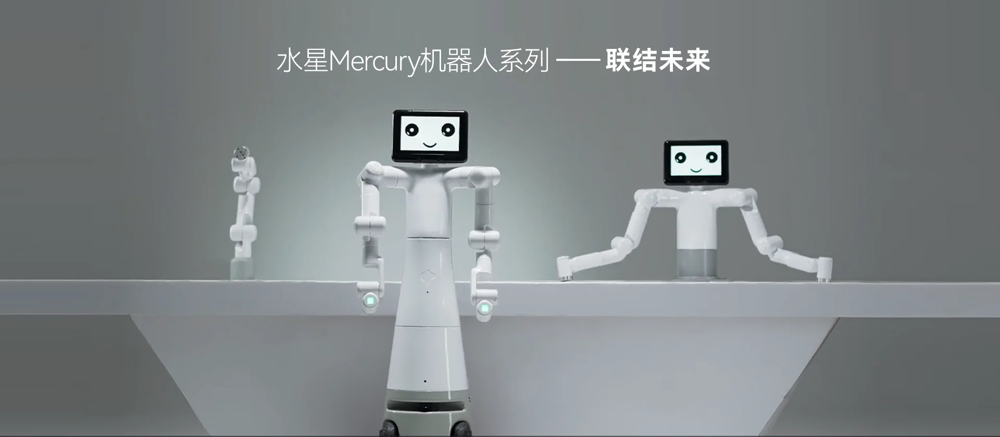

# Mercury_B1_Gitbook

Welcome to the world of Elephant Robotics' Mercury series—where innovation meets practicality, providing an unprecedented universal hardware platform for embodied intelligence and humanoid robot research. We proudly present three unique product models, each with its exceptional features to meet your diverse needs in robotics research and education.

**Mercury X1 Wheeled Humanoid Robot**: With a total of 19 degrees of freedom, it combines a high-performance mobile base with advanced dual-arm coordination and perception capabilities. Equipped with NVIDIA Jetson edge computing core and 3D machine vision, it provides powerful computing and hardware foundation for robotics and embodied intelligence research and development.

 
Mercury X1 Wheeled Humanoid Robot

**Mercury B1 Semi-Humanoid Robot**: Featuring 17 degrees of freedom and dual seven-axis robotic arms, it is equipped with NVIDIA Jetson edge computing core, 3D machine vision, and voice interaction capabilities, making it the preferred choice for human-robot interaction research and dual-arm coordination control research.

 
Mercury B1 Semi-Humanoid Robot

**Mercury A1 Seven-Axis Robotic Arm**: Ideal for educators, this 7-degree-of-freedom lightweight harmonic joint robotic arm has a payload of 1kg. Its touchable quick control interface and application software greatly simplify application deployment without complex programming.

 
Mercury A1 Seven-Axis Robotic Arm

The Mercury series is not only a culmination of robotic technology but also a partner in promoting scientific exploration and educational innovation.

---

# Core Documentation

This document contains comprehensive information from product introduction, detailed technical parameters to user instructions and first-time installation guidance. We will delve into the basic functions of the Mercury B1 Humanoid Robot, provide software development guides, and showcase successful application cases to help you understand how to effectively integrate the Mercury B1 Humanoid Robot into various applications. Additionally, we offer rich support and service information to ensure you can get the necessary help when facing any technical challenges.

---

# Document Instructions

Depending on your needs and the professional level of Mercury B1 Humanoid Robot application development, you can choose to follow the sequence from start to finish or use it as a standalone reference. You can navigate to any section at any time using the sidebar on the left. The document is divided into the following five main sections:

#### Product Introduction
The product information section in the product introduction will provide you with a basic overview of the robotic arm, including design intentions, main functions, and application scenarios, helping you quickly understand the basic characteristics and usage environment of the product. Additionally, this section will detail application examples and supported extended development, providing you with necessary development guides and resources. At the end of the document, relevant purchase links and channels will be provided for your convenience.

The product parameters section will show you detailed technical specifications, including machine specifications, control core parameters, structural dimensions, and electrical characteristics. This information is crucial for understanding the technical standards and performance indicators of the product. Additionally, Cartesian coordinate system information about the working range and accuracy of the robotic arm will be provided for users who want to perform precise operations.

#### Basic Setup
This chapter is an important part that every user of this product must read carefully. It covers key information about product usage, transportation, storage, and maintenance, aiming to ensure user safety and efficiency when operating the product. Additionally, this chapter details the responsibilities for product failures or damages caused by not following these guidelines.

#### Functions and Applications
The functions and applications section details the basic functions and software usage methods of the robotic arm, including system usage instructions and firmware functions. The software development guide provides guidance based on different development environments, such as Python and ROS, supporting technical developers in application expansion. By showcasing successful application cases and providing supporting resources, it offers practical references and necessary support materials to help you understand and use the product more deeply.

#### Support and Services
The support and services section will provide you with comprehensive troubleshooting guides and post-purchase service information, such as warranty and service terms, helping you quickly resolve issues and ensuring you understand your rights and obligations after purchase. Additionally, the 'About Us' section enhances users' understanding of the design and manufacturer of the Mercury series products, aiming to build trust and brand loyalty.

#### Acknowledgments
We greatly appreciate your time reading the Mercury B1 Humanoid Robot user manual. We hope this document helps you better understand and effectively use this robot, inspiring your creativity. If you have any questions or need further assistance, please feel free to contact our customer support team. We look forward to seeing you complete innovative projects with the Mercury B1 Humanoid Robot and welcome you to join our rapidly growing developer community.

---

# Table of Contents

## Product Information

* [1 Product Introduction](1-ProductIntroduction/README.md)
* [2 Product Parameters](2-ProductFeature/README.md)

## Basic Setup

* [3 User Instructions](3-UserNotes/README.md)  
* [4 First Installation](4-FirstInstallAndUse/README.md)

## Functions and Applications

* [5 Software Development Guide](6-SDKDevelopment/README.md)
  * [5.1 Development Using Python](6-SDKDevelopment/6.1-Python/README.md)
    * [1 API Introduction](6-SDKDevelopment/6.1-Python/6.1.2-ApplicationBasePython.md)
    * [2 Python Examples](6-SDKDevelopment/6.1-Python/6.1.3-PythonDemo.md)
    * [3 Drag Teaching](6-SDKDevelopment/6.1-Python/6.1.4-Drag_teach.md)
  * [5.2 ROS1](6-SDKDevelopment/6.2-ROS1/README.md)
    * [1 Environment Setup](6-SDKDevelopment/6.2-ROS1/6.2.1-EnvironmentBuilding.md)
    * [2 ROS Basics](6-SDKDevelopment/6.2-ROS1/6.2.2-ROS_Basics.md)
    * [3 Using Rviz](6-SDKDevelopment/6.2-ROS1/6.2.3-RvizIntroduction.md)
    * [4 Basic Function Examples](6-SDKDevelopment/6.2-ROS1/6.2.4-BasicFunction.md)
  * [5.3 ROS2](6-SDKDevelopment/6.3-ROS2/README.md)
    * [1 Environment Setup](6-SDKDevelopment/6.3-ROS2/6.3.1-EnvironmentBuilding.md)
    * [2 ROS2 Basics](6-SDKDevelopment/6.3-ROS2/6.3.2-ROS2_Basics.md)
    * [3 Using Rviz2](6-SDKDevelopment/6.3-ROS2/6.3.3-Rviz2Introduction.md)
    * [4 Basic Function Examples](6-SDKDevelopment/6.3-ROS2/6.3.4-BasicFunction.md)
* [6 Robot Usage Scenarios](7-ExamplesRobotsUsing/README.md)

## Support and Services

  * [7 About Us](8-AboutUs/README.md)

## Acknowledgments

  - [8 Acknowledgments](9-Acknowledgments/README.md)